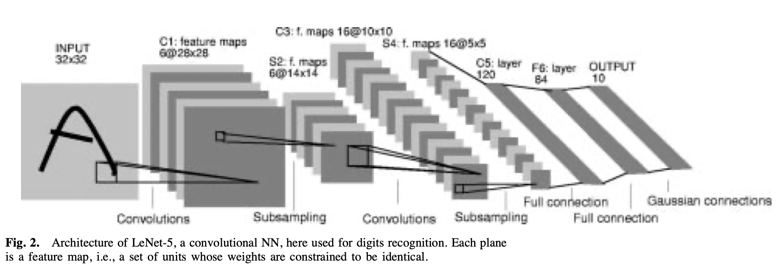
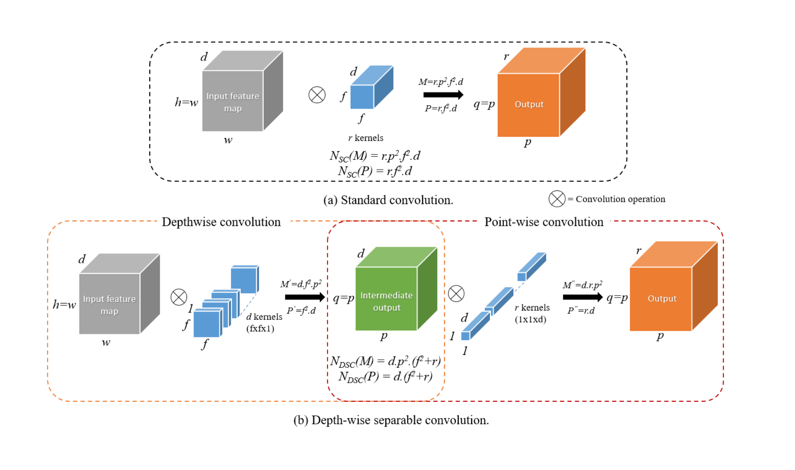

# LeNet-5 with Depthwise Convolution for MNIST

--- 

## Overview

This repository contains an implementation of the LeNet-5 neural network, originally proposed in the paper "Gradient-based learning applied to document recognition" by Yann LeCun et al. We have modified the standard convolutional layers by replacing them with depthwise convolutions to enhance computational efficiency.

## LeNet-5 Architecture

LeNet-5 is a convolutional neural network designed for handwritten digit recognition. The architecture consists of the following layers:

Input Layer: 32x32 grayscale image.

C1 - Convolution Layer: 6 filters of size 5x5, followed by activation (tanh in original paper, ReLU used here).

S2 - Subsampling (Pooling) Layer: 2x2 average pooling.

C3 - Convolution Layer: 16 filters of size 5x5.

S4 - Subsampling (Pooling) Layer: 2x2 average pooling.

C5 - Fully Connected Convolutional Layer: 120 feature maps with 5x5 convolution.

F6 - Fully Connected Layer: 84 neurons.

Output Layer: 10 neurons (one for each digit from 0 to 9) using softmax activation.

---

## Depthwise Convolution

Depthwise convolution is an efficient variant of standard convolution, where instead of applying a filter across all input channels at once, each filter is applied independently to a single input channel. This drastically reduces the number of computations.

**Standard Convolution**: Uses a single filter across all channels.

In a standard convolutional layer:
	•	Let  $f \times f$  be the filter (kernel) size.
	•	Let  $d$  be the number of input channels.
	•	Let  $r$  be the number of output channels.
	•	Let  $p \times p$  be the spatial size of the output feature map.

Each output channel is computed by applying  $d$  filters (each of size  $f \times f$ ) across all input channels, meaning:

$\text{Total Multiplications} = f^2 \times d \times r \times p^2$

$\text{Total Parameters} = f^2 \times d \times r$

**Depthwise Convolution**: Uses separate filters for each channel, followed by a pointwise convolution to combine the information across channels.

In depthwise convolution:

- Instead of applying  $r$ filters across all input channels, we apply one  $f \times f$  filter per channel separately.
- This means we have only  $d$  filters, each applied to one input channel.
- To combine information across channels, a pointwise convolution (1x1 convolution) follows, which projects the depthwise output to  $r$  channels.

**Step 1: Depthwise Convolution**

$\text{Total Multiplications (Depthwise)} = f^2 \times d \times p^2$

$\text{Total Parameters (Depthwise)} = f^2 \times d$

**Step 2: Pointwise Convolution (1x1)**

$\text{Total Multiplications (Pointwise)} = 1^2 \times d \times r \times p^2 = d \times r \times p^2$

$\text{Total Parameters (Pointwise)} = d \times r$

---

## Why Use Depthwise Convolution?

Depthwise convolution significantly reduces the number of computations compared to standard convolution. Below is the mathematical difference between them.

#### Computational Cost Comparison

**For standard convolution:**

$\text{Total Computations} = f^2 \times d \times r \times p^2$

**For depthwise convolution:**

$\text{Total Computations} = (f^2 \times d \times p^2) + d \times r \times p^2)$

**The ratio of computations:**

$\frac{\text{Depthwise + Pointwise Computations}}{\text{Standard Convolution Computations}} = \frac{f^2 \times d \times p^2 + d \times r \times p^2}{f^2 \times d \times r \times p^2}$

$= \frac{f^2 d + d r}{f^2 d r}$

Approximating for large  $r$ :

$\approx \frac{1}{r} + \frac{1}{f^2}$

For  $f = 3$  and large  $r$ :

$\approx \frac{1}{r} = \frac{1}{C_{out}}$

Since  $r$  is typically much larger than 9, this shows that depthwise separable convolution **reduces the computations by a factor of approximately**  $\frac{1}{r}$ , making it significantly faster.

---

#### Files in This Repository

- `lenet_backbone.py`: Defines the original LeNet-5 architecture.

- `depth_wise.py`: Implements the modified LeNet-5 with depthwise convolution.

- `train_normal.py`: Training script for standard LeNet-5.

- `train_d.py`: Training script for depthwise convolution-based LeNet-5.

#### Usage

To train the model with standard convolutions:

`python train_normal.py`

To train the model with depthwise convolutions:

`python train_d.py`

